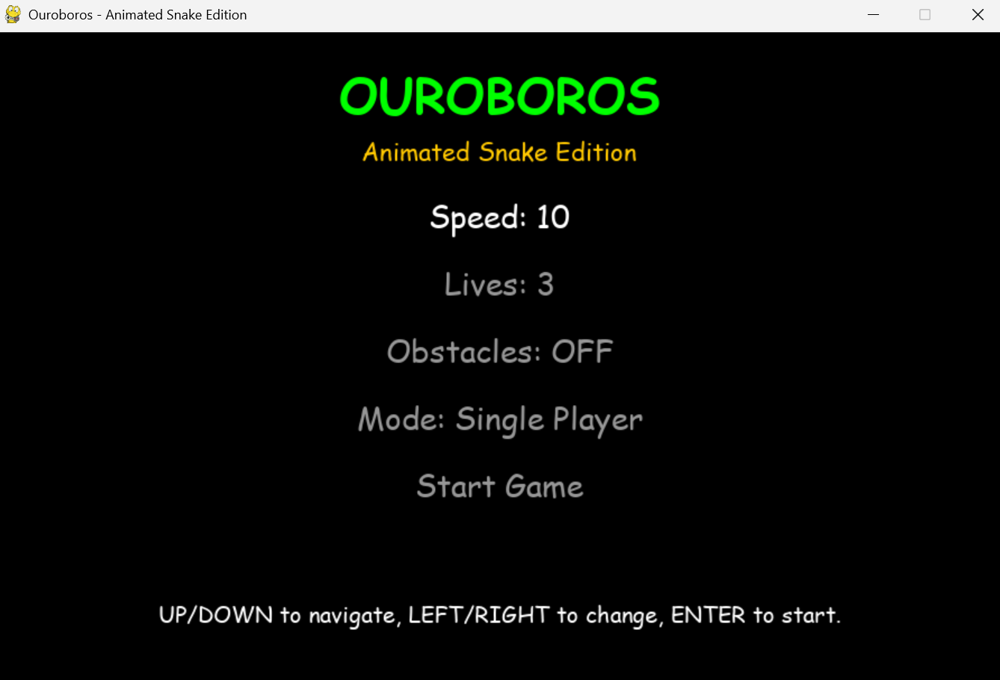
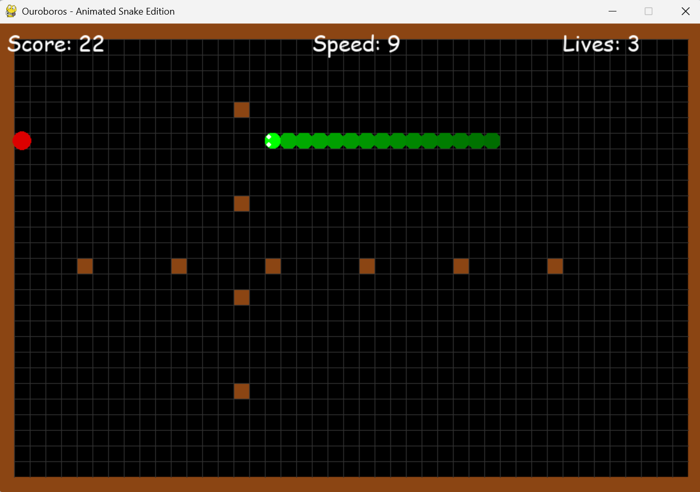
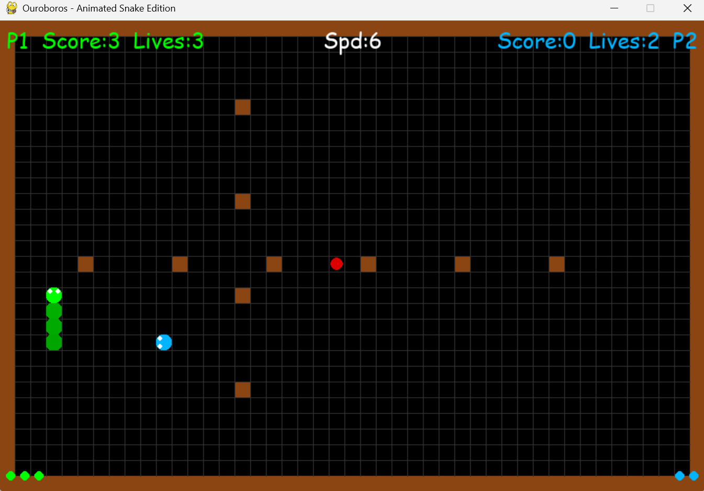
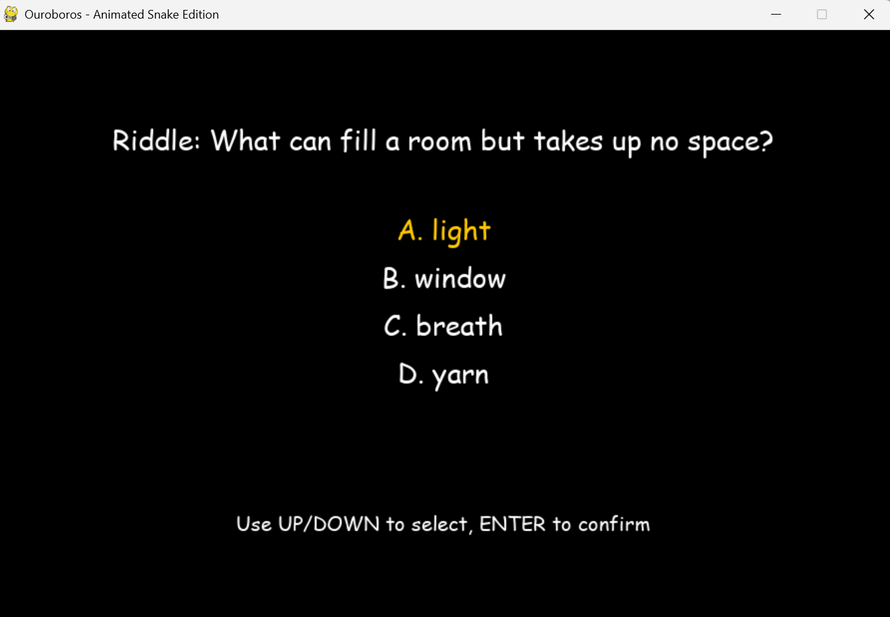

# 🐍 Ouroboros – Animated Snake Edition

A modern and feature-rich Snake game built with **Pygame**, combining classic gameplay with animations, puzzles, and multiplayer action.

---

## 🎮 Features

* 🐍 Smooth animated snake (eyes + tongue animation)
* 🍎 Multiple food types:

  * 🔴 Normal (+1 score)
  * 🟡 Golden (+5 score)
  * 🟣 Poison (triggers a riddle challenge)
* 🧠 Built-in **riddle system** for second chances
* ❤️ Lives system (instead of instant death)
* 🧱 Optional obstacles
* 👥 Local **multiplayer mode**
* 🔊 Sound effects and background music
* 🎨 Clean UI with menu system

---
## 📸 Screenshots

<p align="center">
  
  
</p>

<p align="center">
  
  
</p>


---

## 🕹️ Controls

### Single Player

* Arrow Keys → Move
* `W / S` → Increase / decrease speed

### Multiplayer

* **Player 1 (Green)** → Arrow Keys
* **Player 2 (Blue)** → `W A S D`

---

## 🧠 Riddle Mechanic

When you:

* Crash into a wall, yourself, or obstacle
* Eat poison food

You must answer a **multiple-choice riddle**:

* ✅ Correct → Gain a life
* ❌ Wrong → Lose a life

---

## ⚙️ Game Settings

From the main menu, you can customize:

* Game speed
* Number of lives
* Obstacles ON/OFF
* Game mode:

  * Single Player
  * Multiplayer

---

## 👥 Multiplayer Rules

* Each player has separate score and lives
* Collision = lose 1 life + respawn
* When a player reaches 0 lives → **they lose**
* Last player alive wins
* Simultaneous death = draw

---

## 📦 Requirements

* Python 3.x
* Pygame

Install dependencies:

```bash
pip install pygame
```

---

## ▶️ How to Run

```bash
python main.py
```

---

## 🔊 Assets

Make sure these files are in the same directory:

* `eat.wav` → sound effect when eating
* `music.mp3` → background music

If missing, the game will still run but without audio.

---

## 📁 Project Structure


├── main.py
├── eat.wav
├── music.mp3
├── README.md
└── tests/
    ├── test_food.py
    ├── test_food_type.py
    ├── test_obstacles.py
    └── test_riddles.py

## 🚀 Future Improvements

* High score saving system
* Online multiplayer
* Mobile version
* More power-ups and levels
* Boss fights or special challenges


## ⭐ Support

If you like this project, consider giving it a ⭐ on GitHub!
